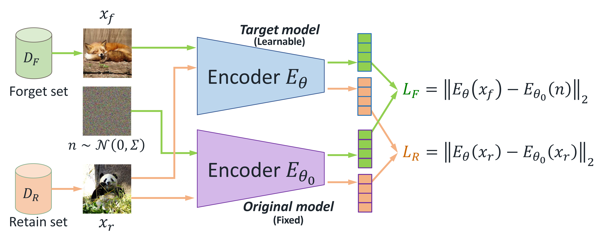

This is a PyTorch/GPU implementation of the paper 
<a href="https://openreview.net/pdf?id=9hjVoPWPnh">Machine Unlearning for Image-to-Image Generative Models</a> (ICLR 2024).
This work is a general framework to remove some concepts/knowledge from a pretained
image-to-image generation models.
<p align="center">
  
</p>

<p align="center">
  
</p>

## Installation

Download the repo
```
git clone https://github.com/jpmorganchase/i2i-generator-unlearning.git
cd i2i-generator-unlearning

git clone -b i2i https://github.com/jpmorganchase/i2i_clean-fid.git
git clone -b i2i https://github.com/jpmorganchase/i2i_Palette-Image-to-Image-Diffusion-Models.git
git clone -b i2i https://github.com/jpmorganchase/i2i_mage.git
```

A suitable [conda](https://conda.io/) environment named `mul` can be created and activated with:
```
conda create --name mul python=3.9
conda activate mul
pip install torch==1.13.1+cu117 torchvision==0.14.1+cu117 torchaudio==0.13.1 --extra-index-url https://download.pytorch.org/whl/cu117
pip install -r environment.yaml
```
* This repo is based on [`timm==0.3.2`](https://github.com/rwightman/pytorch-image-models), for which a [fix](https://github.com/rwightman/pytorch-image-models/issues/420#issuecomment-776459842) is needed to work with PyTorch 1.8.1+.


## Dataset Preparation

Run `mkdir ./dataset` to create a folder, and follow the steps below to prepare the datasets:
- Download `ImageNet` dataset from [web](https://www.image-net.org/challenges/LSVRC/2012/2012-downloads.php) or through [Kaggle](https://www.kaggle.com/c/imagenet-object-localization-challenge/data) and put them under `dataset`.
- Download `COCO-2017` dataset from [web](https://cocodataset.org/#download) and put them under `dataset`.
- Download the `Places-365` dataset from [link](http://places2.csail.mit.edu/download-private.html) or through [Kaggle](https://www.kaggle.com/datasets/nickj26/places2-mit-dataset/download?datasetVersionNumber=2) and put them under `dataset`.
    - Note: you can download the *Small images (256 * 256)* to save your space.
    - Please move `dataset/places365/train_256_places365standard/data_256` to `dataset/places365/train_256` and `dataset/places365/val_256/val_256` to `dataset/places365/val_256`.
    - Then, run `python ./i2i_Palette-Image-to-Image-Diffusion-Models/datasets/place365/process_data.py` to cluster the valiation images with labels.

After downloading the three datasets, the folder `dataset` should be orginized as:
```shell
i2i-generator-unlearning/
  i2i_mage/
  i2i_Palette-Image-to-Image-Diffusion-Models/
  i2i_clean-fid/
  dataset/
    imagenet1k/
        train/
        val/
        test/
    coco/
        train2017/
        val2017/
    places365/
        train_256/
        val_256/
        test_256/
```

## Usage

We provide the details of running different type of models seperately:
- For diffusion models, please check [i2i_Palette-Image-to-Image-Diffusion-Models](https://github.com/jpmorganchase/i2i_Palette-Image-to-Image-Diffusion-Models/tree/i2i/README.md) for more details. 
- For VQ-GAN models, please check [i2i_mage](https://github.com/jpmorganchase/i2i_mage/tree/i2i/README.md) for more details. 
- The folder `i2i_clean-fid` is used to compute the Fréchet inception distance (FID) between the generated images. Please follow [i2i_clean-fid](https://github.com/jpmorganchase/i2i_clean-fid/tree/i2i/README.md) for installation and usage.

## Results

- Results in Table 1 and Table 2:
    - Under each folder of models (`VQ-GAN` in [i2i_mage](https://github.com/jpmorganchase/i2i_mage/tree/i2i/) and `Diffusion` in [i2i_Palette-Image-to-Image-Diffusion-Models](https://github.com/jpmorganchase/i2i_Palette-Image-to-Image-Diffusion-Models/tree/i2i/)), we need to unlearn then test these models
    - Following the instructions in the document, unlearn the original model with our approach (with and without proxy $D_R$), multiple baselines (`MAX LOSS`, `NOISY LABEL`, `RETAIN LABEL`, `RANDOM ENCODER`).
    - In total, you will have seven models:
      - Original model, i.e., before unlearning
      - MAX LOSS (Baseline1)
      - NOISY LABEL (Baseline2)
      - RETAIN LABEL (Baseline3)
      - RANDOM ENCODER (Baseline4)
      - **Ours**
      - **Ours (Proxy $D_R$)**
    - Following the instructions in the document, we next conduct the evaluation and compute the FID, IS, and CLIP scores.
    - FID and IS score:
      - Results are recorded in `fid_is_eval_{MODE}.csv`, where `{MODE}` is determined by specific models.
      - Each row in this CSV contains seven elements:
      
        | CKPT+Config | FID (Retain) | Mean IS (Retain) | Std of IS (Retain) | FID (Forget) | Mean IS (Forget)  | Std of IS (Forget) |
        |-------------|--------------|--------------|------------------|------------------|--------------------|--------------------|
        
        > CKPT is the model checkpoint evaluated.
        
        > Config is determined by the test parameters for various inputs, such as cropping size or `random/center` cropping.

    - CLIP score:
      - Results are recorded in `clip_cosine_{MODE}.csv`, where `{MODE}` is determined by specific models.
      - Each row in this CSV contains three elements:
      
        | CKPT+Config | CLIP (Retain) | CLIP (Forget) |
        |-------------|---------------|---------------|

- Results in Figure 1 and Figure 3:
    - When geting the results of Table 1 and Table 2, it will automatically generate various images for both the forget set and the retain set
    - You can compare the generated images by different methods

- Results of T-SNE in Figure 4:
    - Following the instructions in the document, run the T-SNE analysis
    - You can find the results in the `{MODEL}_tsne.pdf`, where `{MODEL}` is decided by the different types of models

- Results of Ablation study in Table 3:
    - Vary the `--forget_alpha` parameter when doing unlearning with our methods
    - Test and evaluate the unlearned models under various `forget_alpha` values
  
## Citation
```
@article{li2024machine_unlearn,
  title={Machine Unlearning for Image-to-Image Generative Models},
  author={Li, Guihong and Hsu, Hsiang and Chen, Chun-Fu (Richard), and Marculescu, Radu},
  journal={International Conference on Learning Representations},
  year={2024}
}
```
## Contact
If you have any questions, feel free to contact us through email (richard.cf.chen@jpmchase.com, hsiang.hsu@jpmchase.com). Enjoy!
